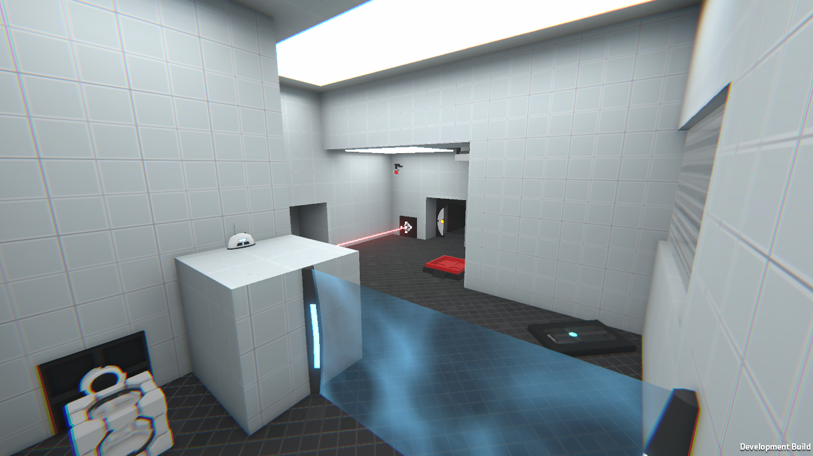

# Portaless
> Valve's Portal 2 ripoff but without portals, made in Unity 3D for fun  

## About
Portaless is a simple fangame made in Unity Engine for fun and experience.
It's featuring well known mechanics from Portal and Portal 2, nice to look at graphics (I hope)
and maybe some original subtleties in the future.
The projects started as my try to replicate lasers from Portal 2, that didn't go so well but
I managed to do this with help of Stack Overflow :) After that I decided to add some more chamber items
and we are here now.

**This project is not going to be a full grown game.**  
I'd like to treat it like a prototype, sandbox, something where we can experiment with new entities,
learn code, project scaling and maintenance. 

Please use `Unity 2020.3.11f1` for best compatibility.

See [Portal 2 on Steam](https://store.steampowered.com/app/620/Portal_2/)

## How to
To run this project you just need to:

1. Clone this repository using `git clone https://github.com/Ezioleq/Portaless.git --depth=1`  
or download it using this [link](https://github.com/Ezioleq/Portaless/archive/refs/heads/master.zip)
and then extract it.

2. Open Unity Hub and add existing project or just open project in running Unity.

3. Enjoy

## Screenshot

